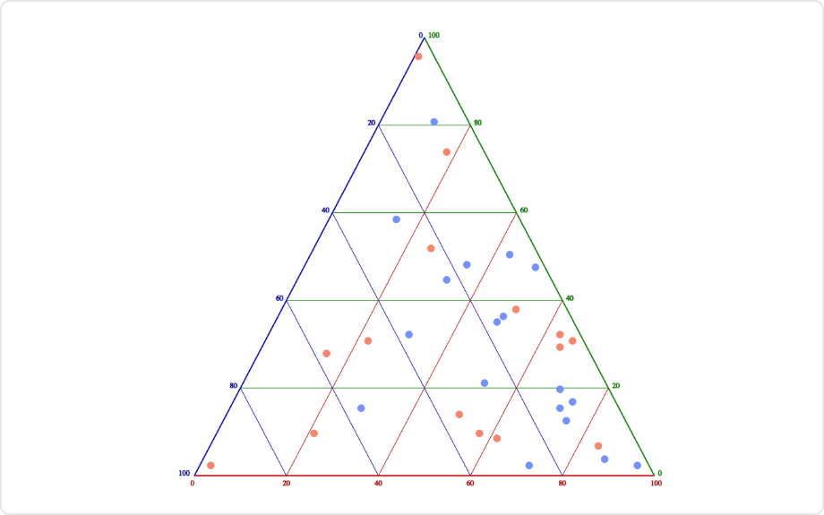

# Ternary Plot Mod for Spotfire®

A barycentric plot on three variables which sum to a constant to graphically depicts the ratios of the three variables as positions in an equilateral triangle.

It is often used in physical chemistry, petrology, mineralogy, metallurgy, and other physical sciences to show the compositions of systems composed of three species.

## Installation & Use

[Download latest version](https://github.com/spotfiresoftware/spotfire-mod-ternary/releases)

The [Wiki](https://github.com/spotfiresoftware/spotfire-mod-ternary/wiki) contains step-by-step instruction on how to install and use this Mod in Spotfire®.

## Building the Project

In a terminal window:
- `npm install`
- `npm start`

In a new terminal window:
- `npm run server`

## About Mods for Spotfire®
-   [TIBCO Community Exchange](https://community.tibco.com/s/global-search/%40uri#q=mod%20for%20tibco%20spotfire&t=Exchange&sort=date%20descending): A safe and trusted place to discover ready-to-use mods
-   [Developer documentation](https://tibcosoftware.github.io/spotfire-mods/docs/): Introduction and tutorials for mods developers
-   [Mods examples](https://github.com/TIBCOSoftware/spotfire-mods/releases/latest): A public repository for examples projects
